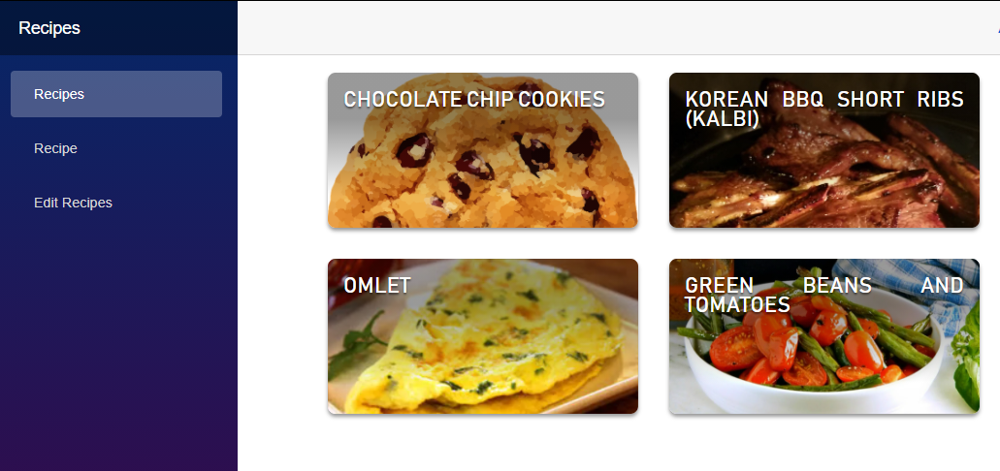

# Recipes - A web site backed by github markdowns

This is a site that optimized for low costs and easy backend handling.  
- Low costs:   
   it is a [Blazor WebAssembly](https://devblogs.microsoft.com/aspnet/blazor-webassembly-3-2-0-now-available/) and being served as a [static site over azure storage](https://docs.microsoft.com/en-us/azure/storage/blobs/storage-blob-static-website)

- Easy backend handling:  
   There is no data base. The recipes are stored and served from markdown files sotred in this repo under the [RecipesMD](RecipesMD) folder
   
 The limitation of using github as a backend is that we are limited for 5k requests per hour. But since this is for personal use - I'm ok with that.
 
 
 ---
 
 

